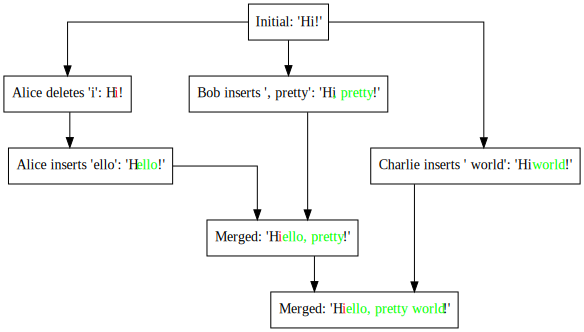
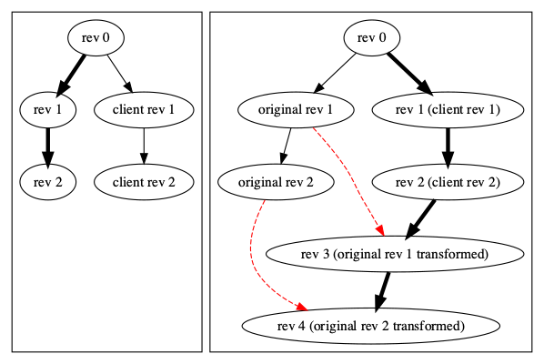

# Text-VersionControl
## Introduction

Text-VersionControl provides version and concurrency control for text editing based on [OT(Operatioal Transformation)](https://en.wikipedia.org/wiki/Operational_transformation) and [CRDT (Conflict-free Replicated Data Type)](https://en.wikipedia.org/wiki/Conflict-free_replicated_data_type) ideas. It's for use in real-time, distributed collaborative document editing and history management for text contents.


## Operations and Delta

Text-VersionControl utilizes [Quill](https://quilljs.com)'s [Delta representation in JSON](https://quilljs.com/docs/delta/). It supports Operational Transformation's basic representations(retain, delete, and insert). The delta format also provides attributes and embedded objects for expressing complex content besides simple text. 

### Operations

* Content can be expressed using insert operations
		* `{insert: "Hello"}, {insert: "World", attributes: {"color": "red"}}, {insert: {"video": "http://youtube.com/sOdLN"}}`
* Operations
	* `{retain: 5}`
	* `{delete: 2}`
	* `{insert: "Hello World!"}`
	* `[{retain:5}, {delete:2}, {insert: "Hello World!"}]`
* Embedded objects can hold a map of string->string, 
	* `{insert: {"img":"file:///img.gif"}}`
* Content with attributes using insert
  	* `{insert: "Hello", attributes: {"link": "http://github.com"}}`
* Adding attributes using retain
    * `{retain: 5, attributes: {"link": "http://github.com"}}`
* Removing attributes using retain
	* `{retain: 5, attributes: {"link": null}}`

## Delta


### Constructing Delta
`new Delta(ops?:Op[])`

* Initialize with JSON
	* `new Delta([{retain:5}, {delete:2}, {insert: "Hello World!"}])`
* Construct by Chaining
	* `new Delta().retain(5).delete(2).insert("Hello World!")`
	* Available methods
		* `.insert(content: string | object, attributes?)`
		* `.retain(count: number, attributes?)`
		* `.delete(count: number)`


### Delta methods (immutable)
* `.normalize()`
	* Returns a more compact and equivalent delta by removing redundant or effectless operations
	* Equivalent to `normalizeDeltas(delta)`

* `.take(start, end)`
	* Return new delta slicing the original delta by the given range
	* e.g. `new Delta().insert('Hello').take(1,2)` equals `new Delta().insert('e')`
	* equivalent to `cropContent(delta, start, end)`
	
* `.apply(other:Delta):Delta` or `.compose(other:Delta):Delta`
	* This methods combines two deltas into a single flattened delta.
	* Equivalent to `flattenDeltas(delta, other)`

* `.transform(other:Delta, priority = false)`
	* Returns transformed `other` as if this delta has preceded it
	* `priority` is used for insert tiebreaking
	* Equivalent to `transformDeltas(delta, other, priority)`

* `.invert(baseContent:Delta):Delta`	
	* Produces the inversion of the change when applied on `baseContent`. Useful for generating an undo change.
	* equivalent to `invertChange(baseConent, delta)`

	
### Primitives
Text-VersionControl provides utility functions to manipulate deltas

* `flattenDeltas(...deltas:Delta[]):Delta`
	* Flattens a sequence of multiple deltas into a single equivalent delta
* `applyChanges(content:Delta, changes:Delta[]):Delta`
	* Returns altered content, applying the changes in sequence
	* It calls flattenDeltas under the hood
* `invertChange(baseContent:Delta, change:Delta):Delta`
	* Given a base content, returns the inverse change that would undo the given change when applied
	* In other words, it returns the `D'` where `baseContent.apply(D).apply(D') == baseContent` holds for content `baseContent` and change `D`.
* `filterChanges(baseContent:Delta, changes:Delta[], criteria:(idx:number, change:Delta):Delta[]`
	* Filters (in) changes fulfilling criteria given a base content and changes. Useful to rule out certain changes keeping rest of changes instact

## SharedString



SharedString forms the core of Text-VersionControl's OT and CRDT functionality. SharedString is a mutable object that can be *edited* by receiving changes as delta, with awareness of forking and merging.

* Initialization
	* `ss = SharedString.fromDelta({ops:[{insert:"Hello World"}]})`
	* `ss = SharedString.fromString("Hello World")`
* Applying changes
	* `applyChange(change:Delta, branch:string):Delta`
		* Edits the content by applying change on current content
		* Returns *transformed delta* as if the change was made in linear fashion
		* Multiple users with their own sequence of changes independently can be applied by alternating branch. 

  			```js
  			ss.applyChange(deltasByAlice, "Alice")
  			ss.applyChange(deltasByBob, "Bob")
  			ss.applyChange(deltasByAlice2, "Alice") // second edit by Alice
  			ss.applyChange(deltasByCharlie, "Charlie")
  			```
  		* As long as you keep the order of changes within each branch, the result content will be the same no matter how you order the changes of different branches. This satisfies CRDT characteristics.
  		* `branch` also takes a role as a tiebreaker for concurrent inserts.
  * Wildcard branch lets you simulate a *checkpoint*, where the change is applied as if it's aware of all other changes of different branches
	  * `ss.applyChange(deltasAsSeen, "*")`
		  * The star wildcard branch sees the previous changes of all branches and can be seen by all branches later on
 	  * `ss.applyChange(deltasAsSeen, "_")`
	 	  * The underscore wildcard branch sees the previous changes of all branches but cannot be seen by other branches later on
* Current content as delta
	* `ss.toDelta()`
* Clone current state
	* `ss.clone()`


## History
History utilizes SharedString to provide higher level functionalities. It keeps the content and changes as Delta. 

* Initialization
	* `new History(name:string, initialContent: Delta | string)`
	* `name` here exists for tiebreaking concurrent inserts during merge or rebase.  
* Applying changes
	* By appending at current revision:
		* `history.append(deltas)`
	* By merging forked sequence of changes diverged from a base revision:
		* `history.merge({rev: baseRev, changes: deltasByAlice, branch: "Alice"})`
		
		* `branchName` works as the insert tiebreaker by comparing with History's `name` value
	* By rebasing forked sequence of changes diverged from a base revision. 
		* `history.rebase({rev: baseRev, changes: deltasByAlice, branch: "Alice"})`
		
		* Unlike merging, rebasing forces new set of changes to be first applied on the base revision, followed by existing changes in the history since the base revision, transformed. Beware rebasing replaces changes already recorded in the history.
* Content, changes, and revisions
	
	
	
	* Getting the current revision
		* `history.getCurrentRev()`
	* Getting the content	
		* `history.getContent() // content at current revision`
		* `history.getContentAt(rev)`
	* Getting the changes
		* `history.getChangeAt(rev) // change made on content at rev`
		* `history.getChangesFrom(rev)` 
		* `history.getChangesFromTo(revFrom, revTo)`

## Document

Keeps history and provides more complex handling of document-level operations

### TODO

## Miscellaneous

#### Notes on similiarity and difference to Quill's Delta

Text-VersionControl borrows Quill Delta's representation and many of method names but does not behave the same in a few cases. For example, many of the methods of Quill's Delta reorder adjacent delete and insert (which in most cases does not change the effect), but Text-VersionControl's equivalent methods preserve it. See the following examples:

*  `new Delta().retain(2).delete(2).insert('Hello')`
	*  Quill: `[{ retain: 2 }, { insert: 'Hello' }, { delete: 2 }]`
	*  Text-VersionControl: `[{ retain: 2 }, { delete: 2 }, { insert: 'Hello' }]`
*  `new Delta([{ insert: 'ab' }, { delete: 1 }, { insert: 'cd' }]).compose([{retain: 4}]`
	* Quill: `[{ insert: 'abcd' }, { delete: 1 }]`
	* Text-VersionControl: `[{ insert: 'ab' }, { delete: 1 }, { insert: 'cd' }]`  
