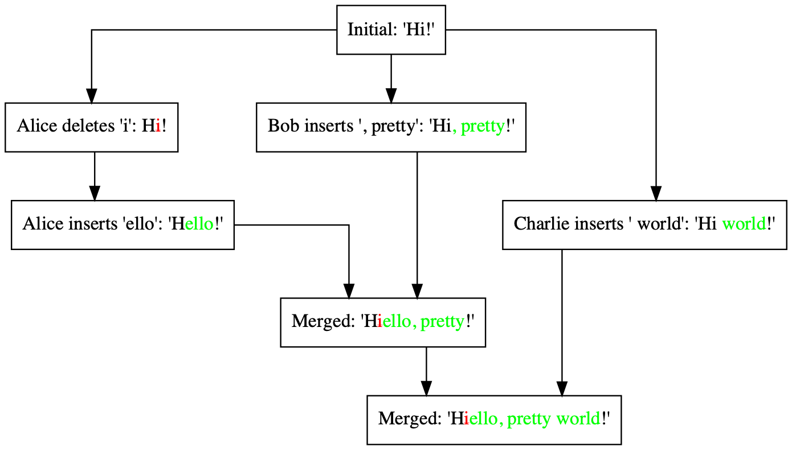

# Text-VersionControl
## Introduction




Text-VersionControl provides version and concurrency control for text editing based on [OT(Operational Transformation)](https://en.wikipedia.org/wiki/Operational_transformation) and [CRDT(Conflict-free Replicated Data Type)](https://en.wikipedia.org/wiki/Conflict-free_replicated_data_type) ideas. It's for use in real-time, distributed collaborative document editing and history management for text contents.


## Getting Started
Install the library by `npm install text-versioncontrol --save`

## Table of Contents

* [Operations and Delta](#operations-and-delta)
	* [Operations](#operations)
	* [Constructing Delta](#constructing-delta)
 	* [Working with Delta](#working-with-delta)
 	* [Utility Functions](#utility-functions)
* [SharedString](#sharedstring)
* [History](#history)
* [Miscellaneous](#miscellaneous)


## Operations and Delta

Text-VersionControl utilizes [Quill](https://quilljs.com)'s [Delta representation in JSON](https://quilljs.com/docs/delta/). It supports Operational Transformation's basic representations(retain, delete, and insert). The delta format also provides attributes and embedded objects for expressing complex content besides simple text. 

### Operations

* Content can be expressed using insert operations

	```js
	{insert: "Hello"}, {insert: "World", attributes: {"color": "red"}}, {insert: {"video": "http://youtube.com/sOdLN"}}
	```

* Operations

	```js
	{retain: 5}
	{delete: 2}
	{insert: "Hello World!"}
	```

* Embedded objects can hold a map of string->string.

	```js
	{insert: {"img": "file:///img.gif"}}
	```

* Content with attributes

  	```js
  	{insert: "Hello", attributes: {"link": "http://github.com"}}
  	```

* Adding attributes

	```js
	{retain: 5, attributes: {"link": "http://github.com"}}
	```

* Removing attributes

	```js
	{retain: 5, attributes: {"link": null}}
	```


### Constructing Delta


```js
new Delta(ops?:Op[])
```

* Initialize with JSON

	```js
	new Delta([{retain: 5}, {delete: 2}, {insert: "Hello World!"}])
	```
* Construct by chaining

	```js
	new Delta().retain(5).delete(2).insert("Hello World!")
	```
	* Available method variants

	```js
	delta.insert("hello") // simple text content
	delta.insert("world", {"color": "red"}) // text with attributes
	delta.insert({"img": "./ball.gif"})	// embedded content
	delta.insert({"video": "./ball.gif"}, {"w": "300", "h": "600"})	// embedded content with attributes
	delta.retain(5)
	delta.retain(3, {"bold": "true"}) // adding or modifying an attribute
	delta.retain(3, {"bold": null}) // removing an attribute
	delta.delete(2)
	```


### Working with Delta

* Examples

	```js
	let delta = new Delta().insert("hello").insert(" world").retain(2).retain(3)
	// normalize
	delta = delta.normalize() // == new Delta().insert("hello world").retain(5)
	// slice
	delta.take(1,2) // == new Delta().insert("e")
	// apply or compose
	delta.apply(new Delta().retain(1).delete(4).insert("i")) // == new Delta().insert("hi world")
	```

* normalize

	```js
	normalize():Delta
	```

	* **Returns**: a more compact and equivalent delta by removing redundant or effect-less operations
	* Equivalent to `normalizeDeltas(delta)`

* take

	```js
	take(start:number, end:number):Delta
	```

	* **Returns**: new delta slicing the original delta by the given range
	* Equivalent to `cropContent(delta, start, end)`

* apply or compose

	```js
	apply(other:Delta):Delta
	compose(other:Delta):Delta
	```

	* **Returns**: Combination of two deltas into a single flattened delta.
	* Applying a change on a content
	* Combining two changes into one
	* Equivalent to `flattenDeltas(delta, other)`

* transform

	```js
	transform(other:Delta, priority = false):Delta
	```

	* **Returns** transformed `other` as if this delta has preceded it
	* `priority` is used for insert tie-breaking
	* Equivalent to `transformDeltas(delta, other, priority)`

* invert

	```js
	invert(baseContent:Delta):Delta
	```
	
	* **Returns**: the inversion of a change when applied on `baseContent`. 
 	* In other words, it returns `D'` where `baseContent.apply(D).apply(D') == baseContent` holds for content `baseContent` and change `D`.
	* Useful for generating an undo change.
	* `baseContent` is required for correctly inverting addition/removal of attributes
	* equivalent to `invertChange(baseConent, delta)`

	
### Utility Functions
Text-VersionControl provides utility functions to manipulate deltas

* `flattenDeltas(...deltas:Delta[]):Delta`
	* Flattens a sequence of multiple deltas into a single equivalent delta
* `filterChanges(baseContent:Delta, changes:Delta[], criteria:(idx:number, change:Delta):Delta[]`
	* Filters changes that are fulfilling criteria given a base content and sequence of changes. Useful to rule out certain changes while keeping (the effect of) rest of changes intact

## SharedString

SharedString forms the core of Text-VersionControl's OT and CRDT functionality. SharedString is a mutable object that can be *edited* by receiving changes as delta. It can consolidate concurrent, distributed edits by multiple users.

### Initialization

```js
ss = SharedString.fromDelta({ops:[{insert:"Hello World"}]})
ss = SharedString.fromString("Hello World")
```

### Applying changes

```js
applyChange(change:Delta, branch:string):Delta
```

* Edits the content by applying change. This mutates SharedString.
* **Returns** *transformed change* as if the change was made in linear fashion
* Multiple users with their own sequence of changes independently can be applied by alternating branch. 

	```js
	ss.applyChange(changeByAlice, "Alice")
	ss.applyChange(changeByBob, "Bob") // Bob is unaware of Alice's change
	ss.applyChange(changeByAlice2, "Alice") // second edit by Alice, while unaware of Bob's change
	ss.applyChange(changeByCharlie, "Charlie") // Charlie is unaware of Alice's or Bob's changes
	```

	* As long as you keep the order of changes within each branch, the result content will be the same no matter how you order the changes of different branches. This satisfies CRDT characteristics.
	* `branch` also takes a role as a tiebreaker for concurrent inserts.
* Wildcard branch lets you simulate a *checkpoint*, where the change is applied as if it's aware of all other changes from different branches

  * The star wildcard branch sees the previous changes of all branches and can be seen by all branches later on

	  ```js
	  ss.applyChange(changeByStar, "*")
	  ss.applyChange(changeByCharlie, "Charlie") // Charlie is aware of change by '*'
	  ```

  * The underscore wildcard branch sees the previous changes of all branches but cannot be seen by other branches later on

	  ```js
	  ss.applyChange(changeByUnderScore, "_")
	  ss.applyChange(changeByCharlie, "Charlie") // Charlie is unaware of change by '_'
	  ```

### Rendering current content

```js
ss.toDelta() // the content seen as if changes in all branches were consolidated
ss.toDelta(branch) // the content visible on specific branch
```

### Other methods

* Clone current state

	```js
	ss.clone()
	```


## History
History utilizes SharedString to provide higher level functionalities such as snapshot access, append, merge, or rebase. It keeps the content and changes as Delta.

### Initialization

```js
new History(name:string, initialContent: Delta | string)
```

* `name` here exists for tie-breaking concurrent inserts during merge or rebase.

### Applying changes

* By appending at current revision:

	```js
	history.append(deltas)
	```

* By merging forked sequence of changes diverged from a base revision:

	```js
	history.merge({rev: baseRev, changes: deltasByAlice, branch: "Alice"})
	```

	
	* **Returns**: `MergeResult`

		```js
		{ rev: number, // latest revision after applying merge
		 content: Delta, // result content
		 reqChanges: Delta[], // request changes (passed changes transformed)
		 resChanges: Delta[] } // response changes (base changes)
		```

	* `branchName` works as the insert tiebreaker by comparing with History's `name` value
* By rebasing forked sequence of changes diverged from a base revision.

	```js
	history.rebase({rev: baseRev, changes: deltasByAlice, branch: "Alice"})
	```

	
	* **Returns**: `MergeResult`

		```js
		{ rev: number, // latest revision after applying rebase
		 content: Delta, // result content
		 reqChanges: Delta[], // request changes (passed changes)
		 resChanges: Delta[] } // response changes (base changes transformed)
		```
	* Unlike merging, rebasing forces new set of changes to be first applied on the base revision, followed by existing changes (transformed) in the history since the base revision. Beware rebasing replaces changes already recorded in the history.

### Revisions, snapshots, and changes


* Getting the current revision

	```js
	history.getCurrentRev()
	```

* Getting the content

	```js
	history.getContent() // content at current revision
	history.getContentAt(rev) // snapshot content at rev
	```

* Getting the changes

	```js
	history.getChangeAt(rev) // change made on content at rev
	history.getChangesFrom(rev)
	history.getChangesFromTo(revFrom, revTo)
	```


## Miscellaneous

##### Notes on similarity and difference to Quill's Delta

Text-VersionControl borrows Quill Delta's representation and many of method names but does not behave the same in a few cases. For example, many of the methods of Quill's Delta reorder adjacent delete and insert (which in most cases does not change the effect), but Text-VersionControl's equivalent methods preserve it. See the following examples:

*  Result of `new Delta().retain(2).delete(2).insert('Hello')`

	```js
	[{retain: 2}, {insert: 'Hello'}, {delete: 2}] // Quill
	[{retain: 2}, {delete: 2}, {insert: 'Hello'}] // Text-VersionControl
	```

*  Result of `new Delta([{insert: 'ab'}, {delete: 1}, {insert: 'cd'}]).compose([{retain: 4}]`

	```js
	[{insert: 'abcd'}, {delete: 1}] // Quill
	[{insert: 'ab'}, {delete: 1}, {insert: 'cd'}] // Text-VersionControl
	```
