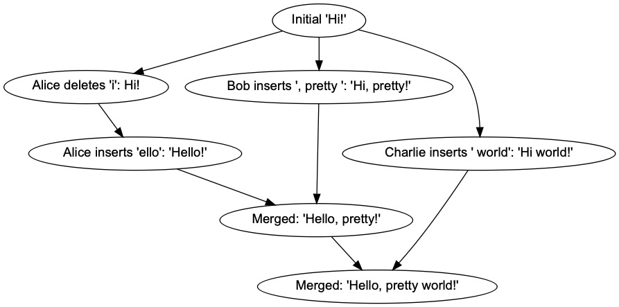

# Text VersionControl
## Introduction

Text-VersionControl provides version and concurrency control for text editing. Based on [OT(Operatioal Transformation)](https://en.wikipedia.org/wiki/Operational_transformation) and [CRDT (Conflict-free Replicated Data Type)](https://en.wikipedia.org/wiki/Conflict-free_replicated_data_type) ideas. For use in real-time collaborative document editing and history management for text contents.

## Operations and Delta

Text-VersionControl utilizes [Quill](https://quilljs.com)'s [Delta representation in JSON](https://quilljs.com/docs/delta/). It supports Operational Transformation's basic representations(retain, delete, and insert). The delta format also provides attributes and embedded objects for expressing complex content besides simple text.


* Delta as content and change representation
	* Although Delta represents *change*, static content can also be expressed using insert operations
		* ```{insert: "Hello"}, {insert: "World", attributes: {"color": "red"}}, {insert: {"video": "http://youtube.com/sOdLN"}}```
* Operations (Quill Op)
	* ```{retain: 5}```
	* ```{delete: 2}```
	* ```{insert: "Hello World!"}```
	* ```[{retain:5}, {delete:2}, {insert: "Hello World!"}]```
* Embedded objects can hold a map of string->string
	* ```{insert: {"img":"file:///img.gif"}}```
* Content with attributes using insert
  	* ```{insert: "Hello", attributes: {"link": "http://github.com"}}```
* Adding attributes using retain
    * ```{retain: 5, attributes: {"link": "http://github.com"}}```
* Removing attributes using retain
	* ```{retain: 5, attributes: {"link": null}}```
* Constructing Delta
	* ```new Delta(ops:Op[])```
		* ```new Delta([{retain:5}, {delete:2}, {insert: "Hello World!"}])```
		* is equivalent to ```new Delta().retain(5).delete(2).insert("Hello World!")```

## Manipulating Delta

Text-VersionControl provides utility functions to manipulate deltas

* ```normalizeDeltas(...deltas:Delta[]):Delta```
	* Returns a more compact and equivalent delta by removing redundant or effectless operations
* ```flattenDeltas(...deltas:Delta[]):Delta```
	* Flattens a sequence of multiple deltas into a single equivalent delta
* ```cropContent(delta:Delta, start:number, end:number):Delta```
	* Cuts content by the given range
* ```applyChanges(content:Delta, changes:Delta[]):Delta```
	* Returns altered content, applying the changes in sequence
	* It is equivalent to flattenDeltas under the hood
* ```invertChange(baseContent:Delta, change:Delta):Delta```
	* Given base content, returns the inverse change that would undo the given change when applied after the change
* ```filterChanges(baseContent:Delta, changes:Delta[], criteria:(idx:number, change:Delta):Delta[]```
	* Filters (in) changes fulfilling criteria given a base content and changes


## SharedString



SharedString forms the core of Text-VersionControl's OT and CRDT functionality. SharedString is a mutable object that can be *edited* by receiving changes as delta, with awareness of forking and merging.

* Initialization
	* ```ss = SharedString.fromDelta({ops:[{insert:"Hello World"}]})```
	* ```ss = SharedString.fromString("Hello World")```
* Applying changes
	* ```applyChange(change:Delta, branch:string):Delta```
		* Edits the content by applying change on current content
		* Returns *transformed delta* as if the change was made in linear fashion
		* Multiple users with their own sequence of changes independently can be applied by alternating branch. 

  			```
  			ss.applyChange(deltasByAlice, "Alice")
  			ss.applyChange(deltasByBob, "Bob")
  			ss.applyChange(deltasByAlice2, "Alice") // second edit by Alice
  			ss.applyChange(deltasByCharlie, "Charlie")
  			```
  		* As long as you keep the order of changes within each branch, the result content will be the same no matter how you order the changes of different branches. This satisfies CRDT characteristics.
  * Wildcard branch lets you simulate a *checkpoint*, where the change is applied as if it's aware of all other changes of different branches
	  * ```ss.applyChange(deltasAsSeen, "*")```
		  * The star wildcard branch sees the previous changes of all branches and can be seen by all branches later on
 	  * ```ss.applyChange(deltasAsSeen, "_")```
	 	  * The underscore wildcard branch sees the previous changes of all branches but cannot be seen by other branches later on
* Current content as delta
	* ```ss.toDelta()```
* Clone current state
	* ```ss.clone()```


## History
History utilizes SharedString to provide higher level functionalities. It keeps the content and changes as delta. 

* Initialization
	* ```new History(name:string, initialContent: Delta | string)```
* Applying changes
	* By appending at current revision:
		* ```history.append(deltas)```
	* By merging forked changes departed from base revision:
		* ```history.merge({rev: baseRev, changes: deltasByAlice, branch: "Alice"})```   
		
	* By rebasing forked changes departed from base revision. 
		* ```history.rebase({rev: baseRev, changes: deltasByAlice, branch: "Alice"})```
		
		* Unlike merging, rebasing forces new changes to be first applied on the base revision, followed by existing changes in history since the base revision transformed. Beware rebasing alters changes already recorded in history.
* Content, changes, and revisions
	
	
	* By default ```rev 0``` contains the initial content
	* Content at ```rev 1``` is made by applying change ```rev 0``` on content at ```rev 0``` 
	* Getting the current revision
		* ```history.getCurrentRev()```
	* Getting the content	
		* ``` history.getContent() // content at current revision```
		* ``` history.getContentAt(rev)```
	* Getting the changes
		* ``` history.getChangeAt(rev) // change made on content at rev```
		* ``` history.getChangesFrom(rev) // changes made on content at rev```
		* ``` history.getChangesFromTo(revFrom, revTo)```

## Document
### TODO
Keeps history and provides more complex handling of document-level operations
